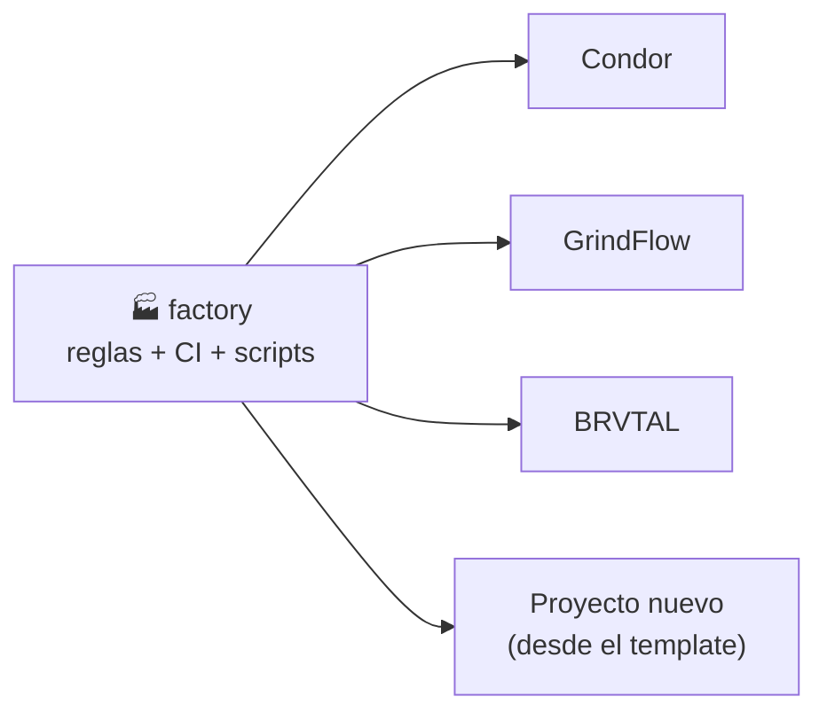
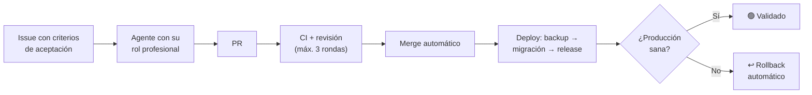

# 🏭 Factory: la fábrica de software de pl0n3r

**Factory es el "manual y la caja de herramientas" que comparten todos los proyectos.** En vez de que cada proyecto (Condor, GrindFlow, BRVTAL…) tenga sus propias reglas, su propio CI y sus propios scripts copiados y cada vez más distintos, todo eso vive **una sola vez aquí** y los proyectos lo usan.

> **En una frase:** aquí se define *cómo* se construye el software; en cada proyecto solo se define *qué* se construye.

---

## ¿Por qué existe?

Hoy los proyectos los construyen agentes de IA (GPT) de forma autónoma. Funcionó, pero aparecieron cuatro problemas:

| Problema | Ejemplo real |
| --- | --- |
| 🔴 El código llega a producción, pero la base de datos no | Condor quedó caído (HTTP 500) porque las migraciones nunca se aplicaron |
| 🔁 Los agentes deshacen decisiones del dueño | Una decisión aprobada fue revertida por otro agente citando una regla vieja |
| 💸 Trabajo sin freno | Un PR de ~100 líneas acumuló ~70 commits de ida y vuelta con los revisores automáticos |
| 🧬 Cada proyecto evoluciona distinto | Etiquetas, releases y CI diferentes en cada repositorio |

Factory resuelve esto centralizando las reglas y automatizaciones, con límites claros.

---

## ¿Cómo funciona?



1. **Factory publica el kit:** CI, deploy con rollback, releases, etiquetas, coordinación de agentes y reglas.
2. **Cada proyecto lo usa** con una línea (`uses: pl0n3r/factory/...@v1`) y solo configura lo suyo: dominio, tecnología e idioma.
3. **Una mejora aquí llega a todos los proyectos** automáticamente, sin copiar nada.
4. **Un proyecto nuevo** se crea desde el template y nace con todo funcionando.

### El ciclo de cada cambio (cuando el kit esté listo)



---

## ¿Qué va a contener?

| Pieza | Para qué sirve |
| --- | --- |
| **CI común** | Las mismas pruebas y controles de calidad en todos los proyectos |
| **Deploy con rollback** | Backup → migración → publicación; si algo falla, vuelve solo a la versión anterior |
| **Releases** | Cada versión crea su tag y su GitHub Release automáticamente |
| **Etiquetas** | Todo Issue y PR con tipo, prioridad y estado, validado |
| **Coordinación** | `/tomar`, `/liberar`: evita que dos agentes hagan lo mismo |
| **Decisiones del dueño como código** | Ningún agente puede revertir una decisión tuya |
| **Roles profesionales** | El agente actúa como DBA, SRE, UX, diseñador, marketing… según la tarea |
| **Métricas y costos** | Tiempo, calidad y costo de cada tarea, con reporte semanal |
| **Template** | Esqueleto para crear un proyecto nuevo ya listo |

---

## Estado actual

🚧 **TANDA 1 está técnicamente avanzada y bloqueada por evidencia externa/material.** El kit base (#1), roles y madurez técnica principal (#2–#8, #11) y el arranque (#14) ya están integrados. Permanecen abiertos #9, #10 y #12; por dependencia, el épico #13 también sigue bloqueado. **`v1` y `v1.0.0` todavía no están publicados.**

| Etapa | Estado |
| --- | --- |
| Plan y reglas definidos | ✅ Hecho |
| Arranque del repositorio (#14) | ✅ Hecho |
| Kit base reusable y template (#1) | ✅ Hecho |
| Roles, orquestación, aceptación, métricas, producto, costos y memoria (#2–#8) | ✅ Hecho |
| Entornos previos a producción (#11) | ✅ Hecho |
| Puerta humana de notificación (#9) | ⛔ Bloqueado · confirmar recepción push móvil real |
| Resiliencia del dueño (#10) | ⛔ Bloqueado · evidenciar identidades/GitHub Apps separadas con mínimo privilegio |
| Cumplimiento legal y de datos (#12) | ⛔ Bloqueado · evidencia material + revisión jurídica/humana; inventario npm de BRVTAL cubierto por lock reproducible del run 36001724208 |
| Épico de madurez (#13) | ⛔ Bloqueado por #9, #10 y #12 |
| Bootstrap del primer `v1` (#41) | ✅ Preparado · [guía de bootstrap](docs/release-bootstrap.md) |
| Publicación `v1.0.0` | ⏸️ No autorizada mientras TANDA 1 siga abierta |
| Adopción en Condor, GrindFlow y BRVTAL | ⏳ TANDA 2 · después del kit `v1` |

El detalle operativo de lo que falta está en **[docs/tanda1-handoff.md](docs/tanda1-handoff.md)**. Los defaults seguros actuales son: no inventar evidencia, no publicar Pages por #35 y no crear `v1`/`v1.0.0` sin la puerta humana correspondiente.

### Roadmap cronológico

| Orden | Issue | Estado actual |
| --- | --- | --- |
| 1 | [#14](https://github.com/pl0n3r/factory/issues/14) | ✅ Arranque integrado |
| 2 | [#1](https://github.com/pl0n3r/factory/issues/1) | ✅ Kit común base + template integrados |
| 3 | [#2](https://github.com/pl0n3r/factory/issues/2) | ✅ Roles profesionales |
| 4 | [#3](https://github.com/pl0n3r/factory/issues/3) · [#4](https://github.com/pl0n3r/factory/issues/4) | ✅ Orquestador · criterios ejecutables |
| 5 | [#5](https://github.com/pl0n3r/factory/issues/5) · [#7](https://github.com/pl0n3r/factory/issues/7) | ✅ Evaluación · control de costos |
| 6 | [#6](https://github.com/pl0n3r/factory/issues/6) · [#8](https://github.com/pl0n3r/factory/issues/8) | ✅ Retroalimentación · memoria compartida |
| 7 | [#11](https://github.com/pl0n3r/factory/issues/11) | ✅ Entornos previos |
| 8 | [#9](https://github.com/pl0n3r/factory/issues/9) | ⛔ Solo falta confirmación externa de recepción push móvil |
| 9 | [#10](https://github.com/pl0n3r/factory/issues/10) | ⛔ Solo falta evidencia de identidades/GitHub Apps separadas |
| 10 | [#12](https://github.com/pl0n3r/factory/issues/12) | ⛔ Falta evidencia material + revisión jurídica/humana |
| 11 | [#13](https://github.com/pl0n3r/factory/issues/13) | ⛔ Se cierra después de #9, #10 y #12 |
| 12 | [#41](https://github.com/pl0n3r/factory/issues/41) | ✅ Bootstrap seguro del primer `v1` documentado |
| 13 | Puerta `release-1.0.0` | ⏸️ Decisión del dueño, solo cuando #1–#14 estén cerrados |
| 14 | TANDA 2 | ⏳ Adopción del kit publicado en Condor → GrindFlow → BRVTAL |

---

## ¿Qué hago yo (el dueño)?

**Casi nada.** Esa es la idea.

1. Abrir un agente en cada repositorio (factory, Condor, GrindFlow, BRVTAL) con **este único prompt**:

   ```
   Lee y ejecuta https://github.com/pl0n3r/factory/blob/main/PLAN-AGENTES.md para el repositorio en el que estás trabajando.
   ```

2. Cuando un agente termine o se detenga, volver a lanzarlo con el mismo prompt: él solo sabe en qué etapa va.
3. Responder únicamente las decisiones que te corresponden: **producto, dinero, legal, datos reales de clientes o salir a producción (live)**.

El detalle de etapas y reglas para los agentes está en **[PLAN-AGENTES.md](PLAN-AGENTES.md)**.

---

## Proyectos de la fábrica

| Proyecto | Qué es | Sitio |
| --- | --- | --- |
| [Condor](https://github.com/pl0n3r/Condor) | Plataforma multi-empresa: catálogo, inventario, pedidos y tienda pública | [condorapp.com.co](https://www.condorapp.com.co) |
| [GrindFlow](https://github.com/pl0n3r/GrindFlow) | SaaS de gestión corporativa | [grindflow.com.co](https://www.grindflow.com.co) |
| [BRVTAL](https://github.com/pl0n3r/brvtal) | Sitio público y panel editorial DISCADMIN | [brvtal.com.co](https://www.brvtal.com.co) |

---

## Glosario rápido

- **Kit:** el conjunto de herramientas compartidas que publica este repo.
- **Reusable workflow:** un proceso de CI escrito una vez aquí y usado por todos los proyectos.
- **Rollback:** volver automáticamente a la versión anterior si la nueva falla.
- **Migración:** cambio en la estructura de la base de datos que acompaña al código nuevo.
- **Template:** plantilla para crear un proyecto nuevo con todo incluido.
- **Épico:** un Issue grande que agrupa varios Issues más pequeños.
