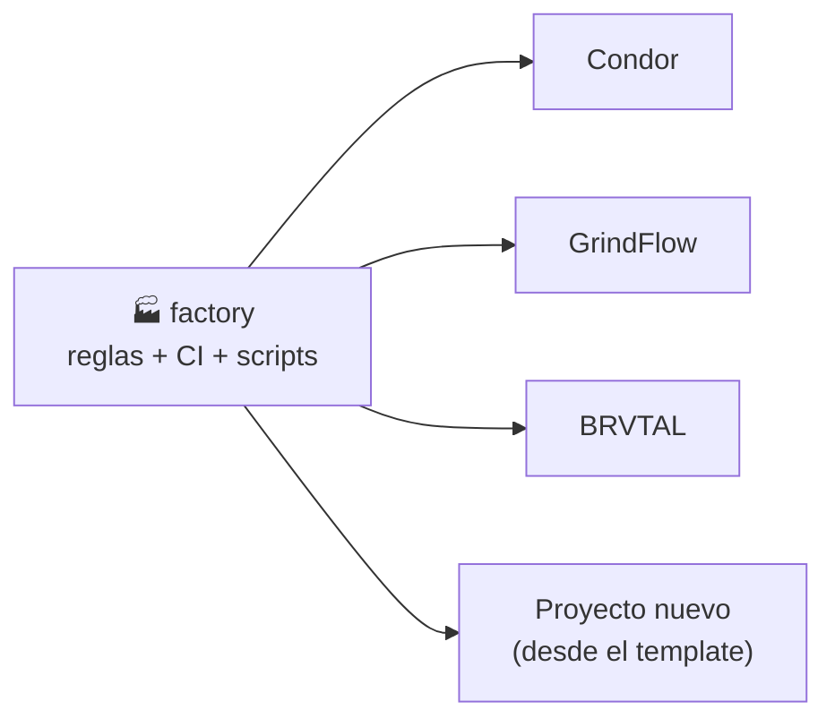
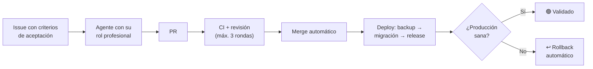

# 🏭 Factory: la fábrica de software de pl0n3r

**Factory es el "manual y la caja de herramientas" que comparten todos los proyectos.** En vez de que cada proyecto (Condor, GrindFlow, BRVTAL…) tenga sus propias reglas, su propio CI y sus propios scripts copiados y cada vez más distintos, todo eso vive **una sola vez aquí** y los proyectos lo usan.

> **En una frase:** aquí se define *cómo* se construye el software; en cada proyecto solo se define *qué* se construye.

---

## ¿Por qué existe?

Hoy los proyectos los construyen agentes de IA (GPT) de forma autónoma. Funcionó, pero aparecieron cuatro problemas:

| Problema | Ejemplo real |
| --- | --- |
| 🔴 El código llega a producción, pero la base de datos no | Condor quedó caído (HTTP 500) porque las migraciones nunca se aplicaron |
| 🔁 Los agentes deshacen decisiones del dueño | Una decisión aprobada fue revertida por otro agente citando una regla vieja |
| 💸 Trabajo sin freno | Un PR de ~100 líneas acumuló ~70 commits de ida y vuelta con los revisores automáticos |
| 🧬 Cada proyecto evoluciona distinto | Etiquetas, releases y CI diferentes en cada repositorio |

Factory resuelve esto centralizando las reglas y automatizaciones, con límites claros.

---

## ¿Cómo funciona?



1. **Factory publica el kit:** CI, deploy con rollback, releases, etiquetas, coordinación de agentes y reglas.
2. **Cada proyecto lo usa** con una línea (`uses: pl0n3r/factory/...@v1`) y solo configura lo suyo: dominio, tecnología e idioma.
3. **Una mejora aquí llega a todos los proyectos** automáticamente, sin copiar nada.
4. **Un proyecto nuevo** se crea desde el template y nace con todo funcionando.

### El ciclo de cada cambio (cuando el kit esté listo)



---

## ¿Qué va a contener?

| Pieza | Para qué sirve |
| --- | --- |
| **CI común** | Las mismas pruebas y controles de calidad en todos los proyectos |
| **Deploy con rollback** | Backup → migración → publicación; si algo falla, vuelve solo a la versión anterior |
| **Releases** | Cada versión crea su tag y su GitHub Release automáticamente |
| **Etiquetas** | Todo Issue y PR con tipo, prioridad y estado, validado |
| **Coordinación** | `/tomar`, `/liberar`: evita que dos agentes hagan lo mismo |
| **Decisiones del dueño como código** | Ningún agente puede revertir una decisión tuya |
| **Roles profesionales** | El agente actúa como DBA, SRE, UX, diseñador, marketing… según la tarea |
| **Métricas y costos** | Tiempo, calidad y costo de cada tarea, con reporte semanal |
| **Template** | Esqueleto para crear un proyecto nuevo ya listo |

---

## Estado actual

🚧 **TANDA 1 sigue abierta por el frente crítico de privacidad como código (#54).** El kit base (#1), roles, madurez técnica (#2–#12), arranque (#14), el set documental de seis piezas (#71) y la regla de perfiles profesionales completos (#74) ya están integrados. **#9, #10 y #12 están cerrados**; #13 permanece abierto únicamente hasta completar #54. **`v1` y `v1.0.0` todavía no están publicados.**

| Etapa | Estado |
| --- | --- |
| Plan y reglas definidos | ✅ Hecho |
| Arranque del repositorio (#14) | ✅ Hecho |
| Kit base reusable y template (#1) | ✅ Hecho |
| Roles, orquestación, aceptación, métricas, producto, costos y memoria (#2–#8) | ✅ Hecho |
| Entornos previos a producción (#11) | ✅ Hecho |
| Puerta humana de notificación (#9) | ✅ Cerrado · recepción push móvil real confirmada |
| Resiliencia del dueño (#10) | ✅ Cerrado · restore externo + modelo de capacidades documentado |
| Cumplimiento técnico legal/datos (#12) | ✅ Cerrado · evidencia técnica/licencias integrada; revisión jurídica separada en #53 |
| Privacidad como código (#54) | ⛔ En curso · revalidar los 3 productos contra 6 documentos + obtener primer reporte real del auditor |
| Épico de madurez (#13) | ⛔ Bloqueado únicamente por #54 |
| Bootstrap del primer `v1` (#41) | ✅ Preparado · [guía de bootstrap](docs/release-bootstrap.md) |
| Publicación `v1.0.0` | ⏸️ No autorizada mientras TANDA 1 siga abierta |
| Adopción en Condor, GrindFlow y BRVTAL | ⏳ TANDA 2 · después del kit `v1` |

El detalle operativo de lo que falta está en **[docs/tanda1-handoff.md](docs/tanda1-handoff.md)**. Los defaults seguros actuales son: no inventar evidencia, no publicar Pages por #35 y no crear `v1`/`v1.0.0` sin la puerta humana correspondiente.

### Roadmap cronológico

| Orden | Issue | Estado actual |
| --- | --- | --- |
| 1 | [#14](https://github.com/pl0n3r/factory/issues/14) | ✅ Arranque integrado |
| 2 | [#1](https://github.com/pl0n3r/factory/issues/1) | ✅ Kit común base + template integrados |
| 3 | [#2](https://github.com/pl0n3r/factory/issues/2) | ✅ Roles profesionales |
| 4 | [#3](https://github.com/pl0n3r/factory/issues/3) · [#4](https://github.com/pl0n3r/factory/issues/4) | ✅ Orquestador · criterios ejecutables |
| 5 | [#5](https://github.com/pl0n3r/factory/issues/5) · [#7](https://github.com/pl0n3r/factory/issues/7) | ✅ Evaluación · control de costos |
| 6 | [#6](https://github.com/pl0n3r/factory/issues/6) · [#8](https://github.com/pl0n3r/factory/issues/8) | ✅ Retroalimentación · memoria compartida |
| 7 | [#11](https://github.com/pl0n3r/factory/issues/11) | ✅ Entornos previos |
| 8 | [#9](https://github.com/pl0n3r/factory/issues/9) | ✅ Puerta humana + recepción móvil real verificadas |
| 9 | [#10](https://github.com/pl0n3r/factory/issues/10) | ✅ Resiliencia y modelo de capacidades cerrados |
| 10 | [#12](https://github.com/pl0n3r/factory/issues/12) | ✅ Cumplimiento técnico de datos/licencias cerrado |
| 11 | [#13](https://github.com/pl0n3r/factory/issues/13) | ⛔ Espera únicamente #54 |
| 12 | [#54](https://github.com/pl0n3r/factory/issues/54) | ⛔ Privacidad como código: adopciones a 6 documentos + primer reporte real |
| 13 | [#41](https://github.com/pl0n3r/factory/issues/41) | ✅ Bootstrap seguro del primer `v1` documentado |
| 14 | Puerta `release-1.0.0` | ⏸️ Decisión del dueño, solo cuando #1–#14 y #54 estén cerrados |
| 15 | TANDA 2 | ⏳ Adopción del kit publicado en Condor → GrindFlow → BRVTAL |

---

## ¿Qué hago yo (el dueño)?

**Casi nada.** Esa es la idea. Abres un agente de IA (GPT u otro), le pegas uno de estos prompts y lo dejas trabajar.

### Los dos modos de lanzar un agente

| Modo | Cuándo usarlo | Qué hace el agente |
| --- | --- | --- |
| **Dirigido** | Quieres que trabaje en un proyecto concreto | Lee factory y trabaja **solo** en ese proyecto |
| **Despachador** | Quieres que él decida dónde hace falta | Lee factory, revisa todos los proyectos y **baja al que más lo necesita** |

**Modo dirigido** (cambia el repositorio según el proyecto):

```
Trabajas en el repositorio pl0n3r/Condor. Lee y ejecuta https://github.com/pl0n3r/factory/blob/main/PLAN-AGENTES.md para este repositorio.
```

Repositorios válidos: `pl0n3r/Condor`, `pl0n3r/GrindFlow`, `pl0n3r/brvtal`, `pl0n3r/factory`, `pl0n3r/ControlBot` (centro de control) y `pl0n3r/AutoFactory` (extensión de los agentes).

**Modo despachador:**

```
Lee y ejecuta https://github.com/pl0n3r/factory/blob/main/PLAN-AGENTES.md en modo despachador.
```

El despachador elige en este orden: sitio caído → incidente abierto → decisión tuya ya respondida → prioridad crítica → alta → media. Nunca toma un proyecto donde otro agente está trabajando, anuncia en el Issue por qué eligió ese trabajo y, al terminar, vuelve a elegir. Detalle en la sección 0 de [PLAN-AGENTES.md](PLAN-AGENTES.md).

### Cómo combinarlos

- **Un solo agente:** modo despachador.
- **Varios agentes a la vez:** uno dirigido a `pl0n3r/factory` para el kit y el resto en modo despachador; se reparten solos sin chocar.
- **Algo urgente en un proyecto:** un agente dirigido a ese proyecto.

### Qué más te toca

1. Cuando un agente termine o se detenga, vuelve a lanzarlo con el mismo prompt: él sabe en qué va.
2. Responder solo las decisiones que te corresponden (**producto, marca, dinero, legal, datos reales de clientes, publicar 1.0.0 o pasar a live**). Te llegan asignadas en GitHub con la etiqueta `decisión: dueño` y aparecen en la cabina.
3. Mirar la **cabina de mando**: https://pl0n3r.github.io/factory/ (estado de todos los proyectos, actualizado cada hora).

### Cómo funciona por dentro

```
Prompt → factory/PLAN-AGENTES.md (cómo trabajar)
       → factory/agentes/roles/<rol>.md (qué profesional ser)
       → AGENTES.md del proyecto (cómo es ese proyecto)
       → trabajo en el proyecto: /tomar → código → PR → CI
```

---

## Proyectos de la fábrica

| Proyecto | Qué es | Sitio |
| --- | --- | --- |
| [Condor](https://github.com/pl0n3r/Condor) | Plataforma multi-empresa: catálogo, inventario, pedidos y tienda pública | [condorapp.com.co](https://www.condorapp.com.co) |
| [GrindFlow](https://github.com/pl0n3r/GrindFlow) | SaaS de gestión corporativa | [grindflow.com.co](https://www.grindflow.com.co) |
| [BRVTAL](https://github.com/pl0n3r/brvtal) | Sitio público y panel editorial DISCADMIN | [brvtal.com.co](https://www.brvtal.com.co) |

---

## Glosario rápido

- **Kit:** el conjunto de herramientas compartidas que publica este repo.
- **Reusable workflow:** un proceso de CI escrito una vez aquí y usado por todos los proyectos.
- **Rollback:** volver automáticamente a la versión anterior si la nueva falla.
- **Migración:** cambio en la estructura de la base de datos que acompaña al código nuevo.
- **Template:** plantilla para crear un proyecto nuevo con todo incluido.
- **Épico:** un Issue grande que agrupa varios Issues más pequeños.
