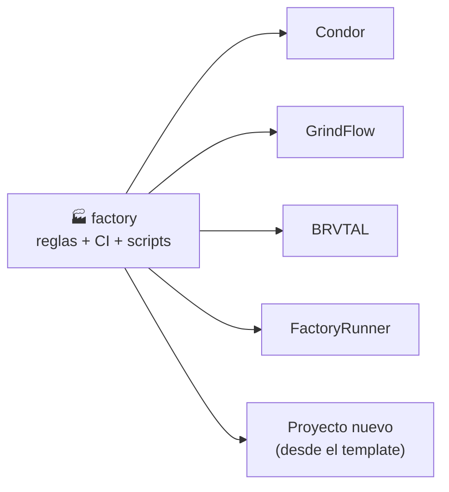
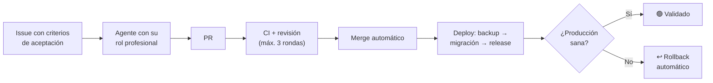

# 🏭 Factory: la fábrica de software de pl0n3r

**Factory es el "manual y la caja de herramientas" que comparten todos los proyectos.** En vez de que cada proyecto (Condor, GrindFlow, BRVTAL, FactoryRunner…) tenga sus propias reglas, su propio CI y sus propios scripts copiados y cada vez más distintos, todo eso vive **una sola vez aquí** y los proyectos lo usan.

> **En una frase:** aquí se define *cómo* se construye el software; en cada proyecto solo se define *qué* se construye.

---

## ¿Por qué existe?

Hoy los proyectos los construyen agentes de IA (GPT) de forma autónoma. Funcionó, pero aparecieron cuatro problemas:

| Problema | Ejemplo real |
| --- | --- |
| 🔴 El código llega a producción, pero la base de datos no | Condor quedó caído (HTTP 500) porque las migraciones nunca se aplicaron |
| 🔁 Los agentes deshacen decisiones del dueño | Una decisión aprobada fue revertida por otro agente citando una regla vieja |
| 💸 Trabajo sin freno | Un PR de ~100 líneas acumuló ~70 commits de ida y vuelta con los revisores automáticos |
| 🧬 Cada proyecto evoluciona distinto | Etiquetas, releases y CI diferentes en cada repositorio |

Factory resuelve esto centralizando las reglas y automatizaciones, con límites claros.

---

## ¿Cómo funciona?



1. **Factory publica el kit:** CI, deploy con rollback, releases, etiquetas, coordinación de agentes y reglas.
2. **Cada proyecto lo usa** con una línea (`uses: pl0n3r/factory/...@v1`) y solo configura lo suyo: dominio, tecnología e idioma.
3. **Una mejora aquí llega a todos los proyectos** automáticamente, sin copiar nada.
4. **Un proyecto nuevo** se crea desde el template y nace con todo funcionando.

### El ciclo de cada cambio (cuando el kit esté listo)



---

## ¿Qué va a contener?

| Pieza | Para qué sirve |
| --- | --- |
| **CI común** | Las mismas pruebas y controles de calidad en todos los proyectos |
| **Deploy con rollback** | Backup → migración → publicación; si algo falla, vuelve solo a la versión anterior |
| **Releases** | Cada versión crea su tag y su GitHub Release automáticamente |
| **Etiquetas** | Todo Issue y PR con tipo, prioridad y estado, validado |
| **Coordinación** | `/tomar`, `/liberar`: evita que dos agentes hagan lo mismo |
| **Decisiones del dueño como código** | Ningún agente puede revertir una decisión tuya |
| **Roles profesionales** | El agente actúa como DBA, SRE, UX, diseñador, marketing… según la tarea |
| **Métricas y costos** | Tiempo, calidad y costo de cada tarea, con reporte semanal |
| **Template** | Esqueleto para crear un proyecto nuevo ya listo |

---

## Estado actual

✅ **TANDA 1 está cerrada.** Condor, GrindFlow y BRVTAL tienen evidencia de producción verde; Factory publicó `v1.0.0` y el self-test consumidor de `@v1` pasó. La adopción del kit está en **TANDA 2**.

El canal `v1` solo cambia mediante una puerta humana ligada al SHA exacto. Los cambios posteriores de Factory se preparan en `main` y llegan a los consumidores únicamente tras un release protegido `v1.x`.

| Etapa | Estado |
| --- | --- |
| Plan, kit base, roles, orquestación, aceptación, métricas, costos y memoria (#1–#14) | ✅ Cerrado |
| Privacidad como código (#54) | ✅ Cerrado |
| Raíz de confianza del canal v1 (#83) | ✅ Cerrado |
| Publicación `v1.0.0` | ✅ Publicado + self-test en verde |
| Catálogo canónico de etiquetas (#100/#105) | ✅ Integrado en `main` |
| Candidato de mantenimiento `v1.0.5` (#138) | 🚧 Hardening de eventos privilegiados en reusables; pendiente merge + gate protegido |
| Release de mantenimiento `v1.x` | 🔐 Requiere puerta `factory-release` por SHA |
| Adopción en Condor, GrindFlow, BRVTAL y FactoryRunner | 🚧 TANDA 2 en curso |
| Revisión jurídica (#53) | 🧭 Decisión humana separada |
| GitHub Pages de la cabina (#35) | 🧭 Default seguro B: no publicar |

El cierre histórico está resumido en **[docs/tanda1-handoff.md](docs/tanda1-handoff.md)** y el proceso de publicación en **[docs/release-bootstrap.md](docs/release-bootstrap.md)**.

### Roadmap cronológico

| Orden | Hito | Estado actual |
| --- | --- | --- |
| 1 | #1–#14 + #54 | ✅ TANDA 1 técnica cerrada |
| 2 | Primer canal `v1` + `v1.0.0` | ✅ Publicado y validado |
| 3 | #100/#105 catálogo de etiquetas | ✅ Integrado en `main` |
| 4 | Release protegido posterior | 🔐 `factory-release` + SHA exacto |
| 5 | Condor#192 · GrindFlow#129 · brvtal#630 · FactoryRunner#1 | 🚧 TANDA 2 |

---

## ¿Qué hago yo (el dueño)?

**Casi nada.** Esa es la idea. Abres un agente de IA (GPT u otro), le pegas uno de estos prompts y lo dejas trabajar.

### Los dos modos de lanzar un agente

| Modo | Cuándo usarlo | Qué hace el agente |
| --- | --- | --- |
| **Dirigido** | Quieres que trabaje en un proyecto concreto | Lee factory y trabaja **solo** en ese proyecto |
| **Despachador** | Quieres que él decida dónde hace falta | Lee factory, revisa todos los proyectos y **baja al que más lo necesita** |

**Modo dirigido** (cambia el repositorio según el proyecto):

```
Trabajas en el repositorio pl0n3r/Condor. Lee y ejecuta https://github.com/pl0n3r/factory/blob/main/PLAN-AGENTES.md para este repositorio.
```

**Cola automática de productos:** `pl0n3r/Condor`, `pl0n3r/GrindFlow`, `pl0n3r/brvtal` y `pl0n3r/FactoryRunner`. En modo dirigido también se puede trabajar en `pl0n3r/factory`, `pl0n3r/ControlBot` (control plane) y `pl0n3r/AutoFactory` (herramienta local/manual).

**Modo despachador:**

```
Lee y ejecuta https://github.com/pl0n3r/factory/blob/main/PLAN-AGENTES.md en modo despachador.
```

El despachador elige en este orden: sitio caído → incidente abierto → decisión tuya ya respondida → prioridad crítica → alta → media. Nunca toma un proyecto donde otro agente está trabajando, anuncia en el Issue por qué eligió ese trabajo y, al terminar, vuelve a elegir. Detalle en la sección 0 de [PLAN-AGENTES.md](PLAN-AGENTES.md).

### Cómo combinarlos

- **Un solo agente:** modo despachador.
- **Varios agentes a la vez:** uno dirigido a `pl0n3r/factory` para el kit y el resto en modo despachador; se reparten solos sin chocar.
- **Algo urgente en un proyecto:** un agente dirigido a ese proyecto.

### Qué más te toca

1. Cuando un agente termine o se detenga, vuelve a lanzarlo con el mismo prompt: él sabe en qué va.
2. Responder solo las decisiones que te corresponden (**producto, marca, dinero, legal, datos reales de clientes, mover/publicar el canal `v1` de Factory o pasar a live**). Te llegan asignadas en GitHub con la etiqueta `decisión: dueño` y aparecen en la cabina.
3. Mirar la **cabina de mando**: https://pl0n3r.github.io/factory/ (estado de todos los proyectos, actualizado cada hora).

### Cómo funciona por dentro

```
Prompt → factory/PLAN-AGENTES.md (cómo trabajar)
       → factory/agentes/roles/<rol>.md (qué profesional ser)
       → AGENTES.md del proyecto (cómo es ese proyecto)
       → trabajo en el proyecto: /tomar → código → PR → CI
```

---

## Proyectos de la fábrica

| Proyecto | Qué es | Sitio |
| --- | --- | --- |
| [Condor](https://github.com/pl0n3r/Condor) | Plataforma multi-empresa: catálogo, inventario, pedidos y tienda pública | [condorapp.com.co](https://www.condorapp.com.co) |
| [GrindFlow](https://github.com/pl0n3r/GrindFlow) | SaaS de gestión corporativa | [grindflow.com.co](https://www.grindflow.com.co) |
| [BRVTAL](https://github.com/pl0n3r/brvtal) | Sitio público y panel editorial DISCADMIN | [brvtal.com.co](https://www.brvtal.com.co) |
| [FactoryRunner](https://github.com/pl0n3r/FactoryRunner) | Execution plane autónomo: agentes, órdenes, adapters y browser execution | En construcción · `control.condorapp.com.co` como target primario |

### Infraestructura de control (fuera de la cola automática de producto)

- **ControlBot:** centro de mando/control plane privado.
- **AutoFactory:** herramienta local/manual independiente; no se modifica desde la cola automática.

---

## Glosario rápido

- **Kit:** el conjunto de herramientas compartidas que publica este repo.
- **Reusable workflow:** un proceso de CI escrito una vez aquí y usado por todos los proyectos.
- **Rollback:** volver automáticamente a la versión anterior si la nueva falla.
- **Migración:** cambio en la estructura de la base de datos que acompaña al código nuevo.
- **Template:** plantilla para crear un proyecto nuevo con todo incluido.
- **Épico:** un Issue grande que agrupa varios Issues más pequeños.


---

## Living Software

**Living Software está integrado al protocolo en su arquitectura y ciclo operativo; el hardening de fronteras de evidencia continúa.**

El objetivo es que Factory pueda observar, recordar, aprender, proponer, experimentar, medir, podar y reparar sin convertir aprendizaje en autoridad. El contrato canónico está documentado en [docs/factory-living-software.md](docs/factory-living-software.md) y las reglas operativas viven en [PLAN-AGENTES.md](PLAN-AGENTES.md#9-living-software-ciclo-operativo-canónico).

El ciclo de alto nivel es:

`observe → learn → experiment → adopt_or_reject → measure → prune`

Ese resumen no reemplaza el lifecycle completo de Constitution. Toda adopción conserva rollback, trazabilidad, invariantes protegidos y límites de autoridad humana.

### Estado de confianza actual

- **#209 Autonomy authority + canonical evidence:** ✅ cerrado.
- **#211 Factory Lab promotion provenance:** 🚧 pendiente.
- **#213 Growth/Pruning source evidence:** 🚧 pendiente.
- **#215 Repair human authority + immunity provenance:** 🚧 pendiente.

Por eso, cerrar #157 significa **integración estructural del protocolo**; no garantiza autonomía completa, promoción autónoma de extremo a extremo ni recuperación autónoma lista para producción. #143 debe permanecer abierto mientras queden hardenings Living Software pendientes.

Las puertas humanas vigentes no cambian: dinero, legal, datos reales/personales, borrado irreversible, publicación/live y demás decisiones reservadas siguen fuera de la autoridad autónoma.
