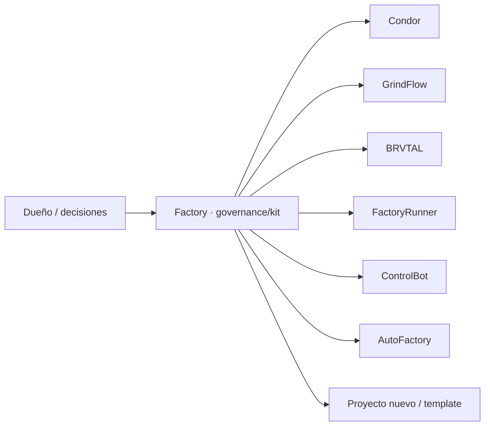

# 🏭 Factory: la fábrica de software de pl0n3r

> Gobernanza, automatización y kit común para la fábrica de software de pl0n3r.

**Rol en la fábrica:** governance/kit · **Fase:** construction · **Roadmap:** [GitHub Issues](https://github.com/pl0n3r/Factory/issues) + [PLAN-AGENTES.md](PLAN-AGENTES.md)

Factory define **cómo** se construye, coordina, valida y entrega software en la fábrica. Los productos y planos de control conservan **qué** construyen y su estado canónico en sus propias fuentes.

## Operational Cockpit

<!-- factory:status:start -->
| Señal | Estado |
| --- | --- |
| main SHA | UNKNOWN |
| versión | UNKNOWN |
| CI | UNKNOWN |
| release | UNKNOWN |
| health | UNKNOWN |
| smoke/observer | UNKNOWN |
| quality/security | UNKNOWN |
| Issue activo | UNKNOWN |
| PR activo | UNKNOWN |
| último release | UNKNOWN |
<!-- factory:status:end -->

> Este bloque es derivado. UNKNOWN/PENDING significa que falta evidencia canónica. Nunca se escribe GREEN manualmente.

## Work Queue

- **NOW:** [cola automática y prioridades canónicas](PLAN-AGENTES.md#0-dónde-trabajar-modo-dirigido-o-modo-despachador).
- **NEXT:** [Issues ready de Factory](https://github.com/pl0n3r/Factory/issues).
- **LATER:** [épicos y planificación](https://github.com/pl0n3r/Factory/issues?q=is%3Aissue+is%3Aopen).
- **BLOCKED:** bloqueos y puertas se consultan en sus Issues y en [decisiones.yml](decisiones.yml).

Esta vista enlaza las fuentes canónicas; no duplica el Roadmap ni funciona como changelog.

## Qué hace el producto

Factory publica contratos y herramientas compartidas para que cada repositorio no mantenga copias divergentes de la misma infraestructura:

- reusable workflows para CI, coordinación, política, privacidad, releases, observación y otras capacidades comunes;
- scripts deterministas para aceptación, orquestación, métricas, memoria y gobernanza;
- catálogo de etiquetas y perfiles profesionales;
- template para nuevos proyectos;
- reglas de autoridad, seguridad y operación que los consumidores pueden validar automáticamente.

Los consumidores usan el kit por canales versionados como `@v1`; las decisiones humanas reservadas siguen en [PLAN-AGENTES.md](PLAN-AGENTES.md) y [decisiones.yml](decisiones.yml).

## Arquitectura en 60 segundos


```mermaid
flowchart LR
    O["Dueño / decisiones"] --> F["Factory · governance/kit"]
    F --> C["Condor"]
    F --> G["GrindFlow"]
    F --> B["BRVTAL"]
    F --> R["FactoryRunner"]
    F --> CB["ControlBot"]
    F --> AF["AutoFactory"]
    F --> N["Proyecto nuevo / template"]
```

Factory es la capa de **governance/kit**. No reemplaza el estado ni la lógica de negocio de los productos y tampoco convierte los demás componentes en una sola aplicación.

## Stack e infraestructura

**Stack declarado:** Python 3 + GitHub Actions + reusable workflows.

- scripts y contratos: Python 3 de biblioteca estándar cuando aplica;
- automatización: GitHub Actions con permisos acotados, timeouts y concurrency;
- distribución del kit: tags/releases versionados y canales mayores protegidos;
- configuración: JSON/YAML/Markdown versionados y verificables;
- ejecución de producto: permanece en cada repositorio consumidor.

## Ciclo de entrega

Issue → criterios de aceptación → reserva → rama canónica → PR → CI/revisión → merge → release del kit cuando aplica → validación del consumidor.

Un merge no equivale a release y un release no equivale a producción validada. La evidencia operativa permanece en checks, Releases, health/smoke e Issues canónicos, no escrita manualmente en este README.

## Calidad y seguridad

- criterios de aceptación ejecutables y fail-closed;
- acciones de terceros fijadas a SHA cuando el contrato lo exige;
- mínimo privilegio y trust boundaries explícitos;
- límites de rondas de revisión y coordinación anti-duplicación;
- privacidad, secretos y datos personales tratados por las políticas comunes;
- rollback y puertas humanas conservan la autoridad definida en [PLAN-AGENTES.md](PLAN-AGENTES.md).

El detalle técnico del repositorio vive en [AGENTES.md](AGENTES.md); las reglas vigentes del dueño viven en [decisiones.yml](decisiones.yml).

## Roadmap y fuentes de verdad

- **Cómo trabajan los agentes y prioridad global:** [PLAN-AGENTES.md](PLAN-AGENTES.md)
- **Contrato técnico de Factory:** [AGENTES.md](AGENTES.md)
- **Decisiones vigentes del dueño:** [decisiones.yml](decisiones.yml)
- **Trabajo y aceptación:** [GitHub Issues](https://github.com/pl0n3r/Factory/issues)
- **Cambios revisados:** [Pull Requests](https://github.com/pl0n3r/Factory/pulls)
- **Entregas del kit:** [GitHub Releases](https://github.com/pl0n3r/Factory/releases)
- **Documentación profunda:** [docs/](docs/)
- **README Contract v1:** [docs/readme-contract.md](docs/readme-contract.md)

El README es una portada. No reemplaza ninguna de estas fuentes.

## Desarrollo local

Validación principal del repositorio:

```bash
python3 -m py_compile scripts/*.py
python3 -m unittest discover -s tests -p 'test_*.py'
```

Suites especializadas se ejecutan desde CI según las rutas presentes (`metricas/`, `seguridad/`, `lecciones/`, `producto/`). No se requieren secretos para ejecutar las pruebas unitarias del kit.

## Mapa de la fábrica

- **Factory:** governance/kit compartido y fuente de contratos comunes.
- **ControlBot:** control plane privado de dashboard, decisiones y orquestación.
- **FactoryRunner:** execution plane autónomo.
- **AutoFactory:** herramienta local/manual independiente.
- **Condor:** producto.
- **GrindFlow:** producto.
- **BRVTAL:** producto.

Los siete repositorios son elegibles para el despachador, pero esa elegibilidad **no mezcla sus responsabilidades arquitectónicas**.
