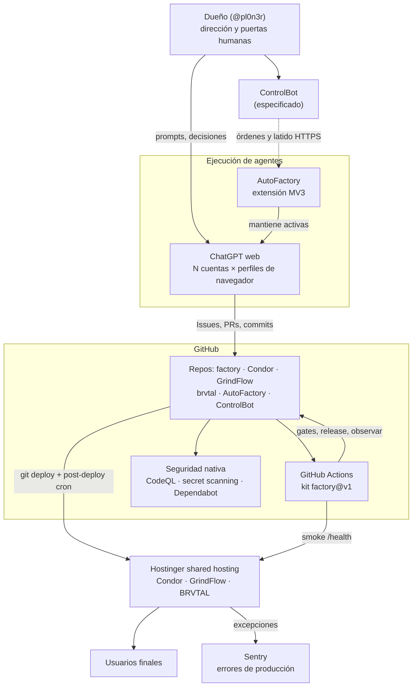
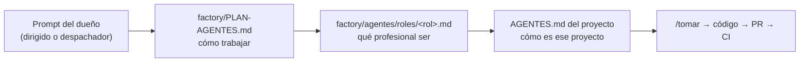
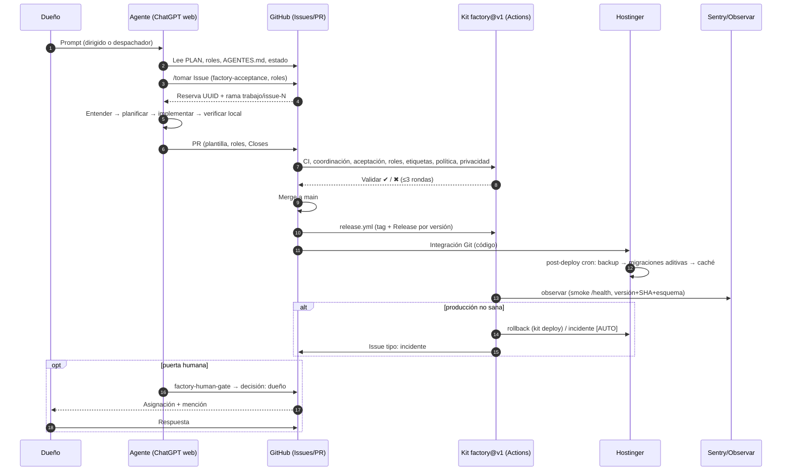
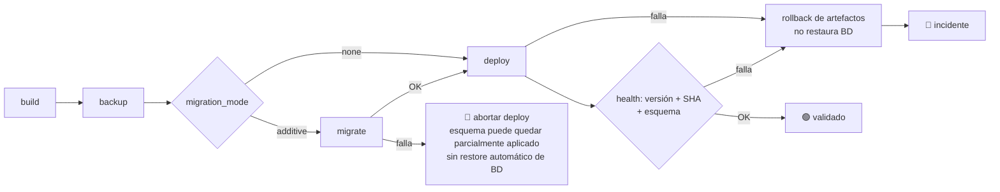
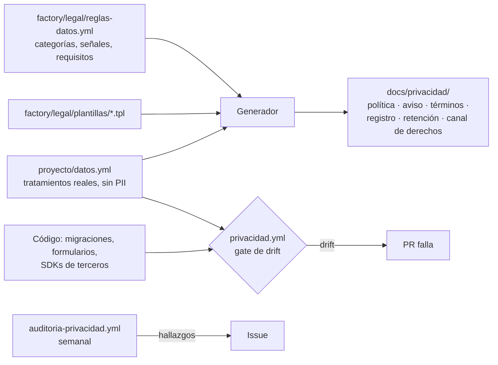

# Especificación técnica de arquitectura: Fábrica de software pl0n3r

| Control del documento | |
| --- | --- |
| **Identificador** | FAC-ARQ-001 |
| **Versión** | 1.1 |
| **Fecha** | 2026-09-24 |
| **Estado** | Vigente. Describe el sistema tal como existe en `pl0n3r/factory@68eef82` y el estado operativo observado ese día |
| **Propietario** | @pl0n3r (dueño y director de la fábrica) |
| **Audiencia** | Dueño (ingeniero de software), agentes de IA y futuros colaboradores técnicos |
| **Clasificación** | Interna. No contiene secretos, credenciales ni datos personales |
| **Fuente de verdad** | Código en `main` de cada repositorio + Issues/PRs enlazados. Si este documento y el código difieren, gana el código; este documento se corrige |

---

## Índice

1. [Resumen ejecutivo](#1-resumen-ejecutivo)
2. [Alcance, principios y glosario](#2-alcance-principios-y-glosario)
3. [Contexto del sistema](#3-contexto-del-sistema)
4. [Arquitectura de repositorios y contenedores](#4-arquitectura-de-repositorios-y-contenedores)
5. [Modelo operativo de agentes](#5-modelo-operativo-de-agentes)
6. [Coordinación, orquestación y aceptación](#6-coordinación-orquestación-y-aceptación)
7. [El kit común (factory v1)](#7-el-kit-común-factory-v1)
8. [Ciclo de vida de un cambio](#8-ciclo-de-vida-de-un-cambio)
9. [Entrega: release, deploy, preview y rollback](#9-entrega-release-deploy-preview-y-rollback)
10. [Gobierno: decisiones, etiquetas y política](#10-gobierno-decisiones-etiquetas-y-política)
11. [Seguridad](#11-seguridad)
12. [Privacidad y cumplimiento](#12-privacidad-y-cumplimiento)
13. [Observabilidad y operación](#13-observabilidad-y-operación)
14. [Métricas y mejora continua](#14-métricas-y-mejora-continua)
15. [Productos de la fábrica](#15-productos-de-la-fábrica)
16. [Herramientas de la fábrica: AutoFactory y ControlBot](#16-herramientas-de-la-fábrica-autofactory-y-controlbot)
17. [Estado actual y hoja de ruta](#17-estado-actual-y-hoja-de-ruta)
18. [Riesgos, limitaciones y deuda técnica](#18-riesgos-limitaciones-y-deuda-técnica)
19. [Manual operativo del dueño](#19-manual-operativo-del-dueño)
20. [Referencias](#20-referencias)

---

## 1. Resumen ejecutivo

La fábrica es un **sistema de desarrollo de software operado por agentes de IA** en el que un único dueño humano fija dirección, reglas y decisiones reservadas, y los agentes implementan, prueban, integran y operan varios productos en producción.

Los componentes centrales son:

- **Productos:** Condor (Symfony), GrindFlow (Laravel) y BRVTAL (PHP plano), desplegados en Hostinger shared hosting.
- **factory:** repositorio público que actúa como **plataforma interna**: el contrato operativo de los agentes (`PLAN-AGENTES.md`), el núcleo común de reglas, 16 perfiles profesionales, y un **kit de reusable workflows de GitHub Actions** con scripts Python de biblioteca estándar que gobiernan CI, coordinación, aceptación, roles, etiquetas, política, privacidad, release, deploy con rollback, preview y observación.
- **AutoFactory:** extensión MV3 (Chrome y Safari) que mantiene trabajando las pestañas de **ChatGPT web**, el motor de ejecución principal, con varias cuentas, una por perfil de navegador.
- **ControlBot:** centro de control web en especificación (dashboard, agentes, chat, despacho, decisiones, alta de proyectos y de cuentas).
- **GitHub:** árbitro del trabajo (Issues, PRs, reservas, etiquetas, rulesets, Actions, seguridad nativa). **Sentry** para errores de producción.

El diseño persigue cuatro propiedades: **autonomía** (el dueño solo decide 7 categorías cerradas), **seguridad fail-closed** (ante duda, no se actúa), **trazabilidad** (todo cambio pasa por Issue → PR → gates → evidencia) y **reutilización** (una regla o gate se escribe una vez en factory y aplica a todos los proyectos).

---

## 2. Alcance, principios y glosario

### 2.1 Alcance

Cubre la arquitectura, los contratos y la operación de: factory, los tres productos, AutoFactory y ControlBot. No cubre el código de negocio interno de cada producto; eso vive en el `AGENTES.md`/`ESPECIFICACIONES.md` de cada repositorio.

### 2.2 Principios de diseño

| # | Principio | Consecuencia concreta |
| --- | --- | --- |
| P1 | **GitHub es el árbitro** | Toda coordinación entre agentes se resuelve con Issues, reservas y PRs, no con conversaciones |
| P2 | **Fail-closed** | Scripts y gates rechazan entradas ambiguas, campos extra, rutas fuera del checkout y estados no demostrados |
| P3 | **Evidencia sobre afirmación** | "Hecho" exige criterios `AC-NN` verificados por test o check exacto, no solo CI genérico en verde |
| P4 | **Decisiones del dueño como código** | `decisiones.yml` es normativo; contradecirlo es un defecto |
| P5 | **Escribir una vez, aplicar en todos** | Reusable workflows versionados (`@v1`) en lugar de copias por repo |
| P6 | **Mínimo privilegio** | `permissions` por job, tokens efímeros, sin PAT personales, acciones fijadas a SHA |
| P7 | **El dueño no hace operación** | La automatización no genera trabajo manual; el dueño solo recibe puertas humanas |
| P8 | **Sin PII en la maquinaria** | Métricas, logs, feedback y privacidad operan con metadatos, nunca con datos personales |

### 2.3 Glosario

| Término | Definición |
| --- | --- |
| **Agente** | Instancia de IA que ejecuta trabajo. Hoy: navegador + perfil + cuenta ChatGPT + pestaña |
| **Tanda** | Fase global de la fábrica (1: producción verde + kit v1; 2: adopción del kit; 3: desarrollo normal) |
| **Reserva** | Lock de un Issue a favor de una sesión, con UUID, creado por `/tomar` |
| **Puerta humana** | Decisión que solo puede tomar el dueño; marker `factory-human-gate` |
| **Épico / factory-plan** | Issue que declara un DAG de tareas hijas para el orquestador |
| **Kit** | Conjunto de reusable workflows, actions y scripts de factory consumidos como `pl0n3r/factory/...@v1` |
| **Canal `v1`** | Tag mayor mutable protegido por ruleset; referencia de confianza del kit |
| **Fase** | `construccion` o `live`; modula permisos de escritura en producción y migraciones |
| **VERDE** | Estado de producción que cumple los 5 criterios de §13.1 |
| **Drift** | Divergencia entre código y artefacto declarado (p. ej. `datos.yml`) |

---

## 3. Contexto del sistema



### 3.1 Actores

| Actor | Rol | Interfaces |
| --- | --- | --- |
| Dueño | Director y única autoridad de las puertas humanas | GitHub, ChatGPT web, cabina privada, ControlBot (futuro) |
| Agentes (ChatGPT web) | Implementación, pruebas, integración y operación | GitHub vía conectores y web; repos locales de trabajo |
| GitHub Actions | Ejecución de gates, coordinación, release, observación | `GITHUB_TOKEN` efímero por corrida |
| Hostinger | Hosting de producción de los tres productos | Integración Git + cron de `post-deploy` |
| Sentry | Captura de excepciones reales de producción | DSN por proyecto (solo envío) |

---

## 4. Arquitectura de repositorios y contenedores

| Repositorio | Visibilidad | Responsabilidad | Stack |
| --- | --- | --- | --- |
| `pl0n3r/factory` | Público | Plataforma interna: plan, reglas, roles, kit v1, template | GitHub Actions, Python 3 stdlib, Bash |
| `pl0n3r/Condor` | Público | Producto: plataforma multi-empresa (catálogo, inventario, pedidos, tienda) | PHP 8.5, Symfony 7.4 LTS, Doctrine, MariaDB, React + TS + Vite, Twig SSR |
| `pl0n3r/GrindFlow` | Público | Producto: SaaS de gestión corporativa | PHP 8.5, Laravel 13, MariaDB, workers Python, módulo `symfony/` |
| `pl0n3r/brvtal` | Público | Producto: sitio público + panel editorial DISCADMIN | PHP 8.5 plano (sin Composer), JS vanilla, MariaDB |
| `pl0n3r/AutoFactory` | Privado | Extensión que mantiene activas las pestañas de ChatGPT | JavaScript MV3, Swift (contenedor Safari) |
| `pl0n3r/ControlBot` | Privado | Centro de control web (especificación en #1) | Previsto: PHP 8.5 + MariaDB en Hostinger |

### 4.1 Estructura de `factory`

| Ruta | Contenido |
| --- | --- |
| `PLAN-AGENTES.md` | Contrato operativo común de todo agente (§5) |
| `AGENTES.md` | Contrato técnico del propio repo factory |
| `agentes/NUCLEO.md` | Reglas compartidas por los proyectos consumidores |
| `agentes/roles/*.md`, `catalogo.json` | 16 perfiles profesionales (§5.4) |
| `decisiones.yml` | Decisiones vigentes del dueño (§10.1) |
| `.github/workflows/` | 23 workflows: reusables del kit + propios del repo (§7.1) |
| `actions/` | 3 composite actions (§7.2) |
| `scripts/` | 21 módulos Python de soporte (§7.3) |
| `metricas/`, `producto/`, `lecciones/`, `seguridad/`, `legal/` | Subsistemas de mejora continua, seguridad y privacidad |
| `labels/es.json`, `labels/en.json` | Catálogos de etiquetas (§10.2) |
| `template/` | Esqueleto de proyecto nuevo que consume el kit (§7.4) |
| `docs/` | Contratos detallados por subsistema (§20) |
| `config/version.json` | Versión del kit (`1.0.0`, pendiente de publicación) |

El repositorio contiene 53 archivos de prueba `unittest`. La calidad se sostiene con el workflow `factory-ci.yml` (actionlint, tests de scripts, coordinación, aceptación y `Validar`), `seguridad.yml`, `costos.yml`, `metricas.yml`, CodeQL y SonarCloud.

---

## 5. Modelo operativo de agentes

### 5.1 Cadena de lectura (bootstrap)



Precedencia normativa (de mayor a menor): **decisiones activas de `decisiones.yml`** → `PLAN-AGENTES.md` → código fusionado y pruebas → `AGENTES.md` del proyecto → Issues/PR activos. Cada `AGENTES.md` de proyecto enlaza al plan (Condor #207, GrindFlow #135, BRVTAL #648, ControlBot) para que un agente lanzado sin prompt también llegue a factory.

### 5.2 Modos de despacho (`PLAN-AGENTES.md` §0)

| Modo | Prompt | Comportamiento |
| --- | --- | --- |
| **Dirigido** | "Trabajas en el repositorio `pl0n3r/X`…" | Trabaja solo en ese repositorio |
| **Despachador** | "…en modo despachador" | Elige el primer caso aplicable: producción no VERDE → incidente abierto → decisión respondida que desbloquea → `crítica` más antigua → `alta` → media; a igual prioridad, lo que más desbloquea. Nunca toma un repo con reserva activa < 30 min; anuncia `Despacho: elegí <repo>#<n> porque <regla N>` |

### 5.3 Bucle de trabajo y límites (`PLAN-AGENTES.md` §2–3)

`ENTENDER → PLANIFICAR → EJECUTAR EN PASOS PEQUEÑOS → VERIFICAR → ENTREGAR → DEJAR MEMORIA`

| Límite | Valor | Motivo |
| --- | --- | --- |
| Commits por PR | ≤ 10 | Evitar el patrón de iteración ciega (un PR llegó a ~70 commits) |
| Rondas de revisión automática | ≤ 3, luego `estado: bloqueado` + resumen | Cortar bucles con Sonar/CodeRabbit |
| Intentos del mismo enfoque | ≤ 2; al tercero, cambiar de enfoque | Evitar hotfixes repetidos (6 seguidos en el incidente de backup de Condor) |
| Revisión de CI | Una vez al terminar; sin polling | Carga sobre GitHub y costo |
| Comentarios | Uno por hito | Ruido y límites secundarios de GitHub |
| Agentes por repo | 1 (factory admite 2 con archivos disjuntos) | Colisiones |

Formatos obligatorios: plantilla de PR (qué y por qué, roles, `Closes #N`, reserva, criterios con evidencia, riesgo y reversión, fuera de alcance), bloque `🧭 DECISIÓN NECESARIA` y bloque `⛔ BLOQUEADO`.

### 5.4 Roles profesionales

Catálogo cerrado de 16 perfiles en `agentes/roles/` (fuente canónica de las etiquetas `rol: …` / `role: …`): arquitectura, ingeniería de software, DBA, SRE, infraestructura, seguridad, QA, UX, diseño visual, frontend, producto, marketing, SEO, contenido, datos/analítica y legal/privacidad. Etiqueta auxiliar: `rol: pendiente`.

Contrato (`docs/roles-profesionales.md`, `scripts/roles_kit.py`, workflow `roles.yml`):

- el PR declara `Rol(es)`, `Rol primario` y el checklist completo de cada rol;
- el motor **deriva roles obligatorios** de los archivos tocados y del tipo del Issue;
- cambios de esquema, seguridad, deploy/workflows o UX pública exigen `Revisión cruzada: <rol>` distinto del primario.

---

## 6. Coordinación, orquestación y aceptación

### 6.1 Coordinación multiagente (`scripts/coordinar_trabajo.py`, 1.934 líneas)

GitHub es el árbitro. Comandos por comentario:

| Comando | Efecto |
| --- | --- |
| `/tomar` | Crea la reserva: marker oculto `<!-- condor-reserva {...,"reservation_id":UUID} -->`, rama canónica `trabajo/issue-N`, `estado: reservado` |
| `/liberar <UUID>` | Libera la reserva |
| `/transferir <UUID>` | Transfiere entre sesiones de la misma cuenta |

Reglas: una reserva es **inactiva** a los 30 minutos sin actividad verificable (commits en la rama o comentarios humanos útiles; bots, checks y etiquetas no cuentan). Un barrido horario marca `estado: requiere recuperación`; el siguiente `/tomar` la recupera con UUID nuevo, reutilizando rama y PR. El job `Validar coordinación` exige en cada PR la rama canónica, la reserva declarada y la ausencia de archivos solapados con otros PR abiertos.

### 6.2 Orquestador (`docs/orquestador.md`, `orquestador_kit.py`, `orquestar_fabrica.py`)

Un épico declara un marker `factory-plan` (`version: 1`, `tasks[]` con `key`, `title`, `owner`, `paths`, `depends_on`). `/planificar` lo materializa de forma idempotente en Issues hijos. `paths` son rutas exactas o prefijos de directorio: sin globs, traversal ni rutas absolutas. `/tomar` falla si hay dependencias abiertas o claims de rutas solapados con otra tarea activa, así que dos tareas sobre la misma ruta deben serializarse por `depends_on`.

### 6.3 Aceptación ejecutable (`docs/aceptacion-ejecutable.md`, `aceptacion_kit.py`)

Dos capas de calidad:

1. **Gates genéricos:** lint, tests, coordinación, CodeQL, Sonar.
2. **Criterios específicos del Issue:** secciones obligatorias (`### Contexto`, `### Alcance`, `### Fuera de alcance`, criterios `AC-NN`) y un marker:

```html
<!-- factory-acceptance {"version":1,"criteria":[
  {"id":"AC-01","kind":"test","target":"ruta/test_x.py::Clase::test_y"},
  {"id":"AC-02","kind":"check","target":"Validar"}]} -->
```

El job `Criterios de aceptación` ejecuta cada target exacto; no admite comandos shell provenientes del Issue. `Validar` depende de él: **un PR no está hecho si solo pasa la primera capa**.

### 6.4 Puertas humanas (`docs/puertas-humanas.md`, `seguridad/puertas_humanas.py`)

Siete categorías cerradas: `product-direction`, `brand`, `money`, `legal`, `real-customer-data`, `release-1.0.0`, `go-live`. El agente las expresa con un marker `factory-human-gate` (contexto acotado, opciones, `recommendation`, `safe_default`). Solo autores `OWNER`/`MEMBER`/`COLLABORATOR` activan la cola; un marker inválido se clasifica `invalid-gate` y retira etiquetas stale. Una puerta válida recibe `decisión: dueño`, se asigna al dueño y lo menciona una sola vez. Sin respuesta, el agente solo puede seguir con el `safe_default` si es seguro y reversible.

### 6.5 Memoria institucional (`lecciones/`)

Registros JSONL por proyecto (`what`, `why`, `prevention`, `source`), solo con causas demostradas. El generador produce un contexto acotado por proyecto para el bootstrap y mide el ahorro de tokens (`task_type=agent-bootstrap`). Falla cerrado ante campos extra, duplicados, timestamps sin zona, symlinks o tamaños excesivos.

---

## 7. El kit común (factory v1)

### 7.1 Reusable workflows (`on: workflow_call`)

| Workflow | Propósito | Inputs principales | Jobs |
| --- | --- | --- | --- |
| `ci.yml` | CI base por stack | `stack`, `domain`, `version_source`, `label_language`, `phase`, `php_version` (8.3 por defecto), `node_enabled`, `node_version`, `working_directory`, `kit_ref` | preflight, php, node, `Validar` |
| `coordinacion.yml` | `/tomar` y sincronización de estado | `operation` (comment/label/pr/issue/validate/sweep), `issue_number`, `pr_number`, `require_reservation`, `kit_ref`… | uno por operación |
| `aceptacion.yml` | Criterios `AC-NN` | `issue_number` | Criterios de aceptación |
| `roles.yml` | Roles profesionales | `mode` (sync/suggest/validate), `number`, `language` | preflight, validate, mutate |
| `etiquetas.yml` | Catálogo y validación de etiquetas | `mode` (sync/validate/sweep), `language`, `issue_number` | etiquetas |
| `politica.yml` | `decisiones.yml` + tope de rondas | `pr_number` | politica |
| `privacidad.yml` | Gate de privacidad como código | `kit_ref` | privacidad |
| `auditoria-privacidad.yml` | Auditoría semanal de privacidad | `kit_ref`, `label_language` | auditar |
| `release.yml` | Tag anotado + GitHub Release idempotente | `version_source`, `version_format`, `version_key`, `factory_bootstrap`, `expected_sha` | release |
| `deploy.yml` | Deploy con backup, migración, health y rollback | `domain`, `health_path`, `version_source`, `phase`, `migration_mode`, `live_migration_approved`; secrets `DEPLOY_TOKEN`, `DATABASE_URL`, `DEPLOY_SSH_KEY` | deploy (concurrency por repo, sin cancelación) |
| `preview.yml` | Preproducción efímera con el mismo pipeline | `version_source`, `migration_mode`, `php_version`, `node_enabled`… | preview |
| `observar.yml` | Smoke de producción | `domain`, `health_path`, `paths`, `version_source` | observar |

Workflows propios de factory: `factory-ci.yml`, `coordinacion-trabajo.yml`, `seguridad.yml`, `costos.yml`, `metricas.yml`, `feedback-producto.yml`, `orquestador.yml`, `cabina.yml`, `reusable-selftest.yml` y `release-bootstrap.yml`.

Invariantes de todos los workflows (verificados por `seguridad/resiliencia.py`): acciones de terceros fijadas a SHA, `permissions` mínimos por job, `timeout-minutes` explícito, `concurrency`, filtros `if:` a nivel de job, sin `pull_request_target` ni `write-all`, y ningún ref flotante salvo el canal `v1` consumido desde `release-bootstrap.yml`.

### 7.2 Composite actions

| Acción | Función |
| --- | --- |
| `actions/retry` | Reintenta con backoff solo operaciones idempotentes de una lista cerrada (`composer-install`, `composer-audit`, `npm-ci`, `npm-audit`) vía `scripts/ci_retry.py` |
| `actions/read-version` | Lee SemVer de la fuente canónica del proyecto sin ejecutar código |
| `actions/idempotent-comment` | Crea o actualiza un único comentario por clave, sin duplicar |

### 7.3 Scripts (Python 3, biblioteca estándar)

| Módulo | Responsabilidad |
| --- | --- |
| `coordinar_trabajo.py` | Reservas, recuperación, validación de PR y colisiones |
| `orquestador_kit.py` / `orquestar_fabrica.py` | Contrato del DAG y materialización idempotente de épicos |
| `aceptacion_kit.py` | Validación de criterios `AC-NN` |
| `roles_kit.py` | Clasificación y validación de roles |
| `labels_kit.py` | Catálogos y selecciones de etiquetas |
| `politica_kit.py` | Decisiones canónicas y rondas de revisión observadas |
| `privacidad_kit.py` / `privacidad_gate.py` / `auditar_privacidad.py` | Privacidad como código, gate de drift y auditoría sin emitir valores |
| `deploy_kit.py` | Orquesta los adapters fijos `ops/factory/*` confinados al checkout |
| `preview_kit.py` | Preview efímero sin secretos live |
| `runtime_health.py` | Health/smoke HTTPS fail-closed: sin redirects y con defensa ante DNS rebinding |
| `observe_kit.py` | Observación de producción |
| `release_bootstrap.py` / `verificar_ruleset_v1.py` | Preflight del primer `v1.0.0` y verificación del ruleset |
| `read_version.py` | SemVer desde fuentes canónicas |
| `safe_io.py` | Lectura confinada al checkout (anti path traversal) |
| `validar_template.py` | Garantiza que `template/` consume el kit sin copias divergentes |
| `ci_retry.py` | Reintentos acotados de operaciones externas |
| `cabina.py` | Generación de la cabina de estado |

### 7.4 Template de proyecto (`template/`)

Esqueleto que ya consume el kit: workflows cliente (`ci`, `coordinacion`, `aceptacion`, `etiquetas`, `politica`, `privacidad`, `auditoria-privacidad`, `release`, `deploy`, `observar`), plantilla de Issue, Dependabot, `AGENTES.md`, `decisiones.yml`, `datos.yml`, documentos de privacidad generados, `config/version.json`, `public/health.php` y los **adapters de entrega** `ops/factory/{build,backup,migrate,deploy,rollback,preview-health,preview-smoke,preview-e2e}`. Los adapters del template fallan cerrado fuera de preview (`FACTORY_PREVIEW=1` y datos sintéticos obligatorios) hasta que el proyecto defina su deploy real.

---

## 8. Ciclo de vida de un cambio



---

## 9. Entrega: release, deploy, preview y rollback

### 9.1 Release del kit

- **Canal mayor `v1`:** tag mutable protegido por el ruleset `factory-v1-trust-root` (id 23958613): target `tag`, enforcement `active`, include exacto `refs/tags/v1`, reglas `creation`/`update`/`deletion` y bypass solo para administradores del repositorio. Verificado con `verificar_ruleset_v1.py` → `status: protected`.
- **Frontera de supply chain:** `release.yml` hace checkout fijo de `pl0n3r/factory@v1`, sin `kit_ref` configurable, así que un caller con escritura no puede elegir otro código del kit.
- **Bootstrap del primer `v1.0.0`** (`release-bootstrap.yml`, dispatch manual con `expected_sha` y `gate_issue`): exige #1–#14 y #54 cerrados, template validado por el CI del candidato, puerta humana `release-1.0.0` cerrada por el dueño con `<!-- factory-release-approval {"sha":"…"} -->`, HEAD de `main` sin cambios, `v1` apuntando al SHA aprobado y ruleset vigente. Después publica `v1.0.0` y ejecuta un self-test del canal publicado.

### 9.2 Release de productos

`release.yml` del kit lee la versión canónica (`config/version.php`, `config/version.json` o constante, según `version_format`/`version_key`), valida SemVer estricto y crea el tag anotado `vX.Y.Z` más la GitHub Release de forma idempotente: no-op si el tag existe en el mismo SHA, completa el Release si faltaba y falla si una versión apunta a otro SHA. Decisión D-056: los tres productos usan este sistema; en BRVTAL reemplaza `update-release-metadata.yml`.

### 9.3 Deploy con rollback (`deploy.yml` + `deploy_kit.py::run_pipeline`)



Pasos ejecutados como adapters fijos `ops/factory/<paso>` dentro del checkout (nunca rutas arbitrarias). `concurrency: deploy-<repo>` sin cancelación, para que nunca corran dos deploys a la vez. En fase `live`, las migraciones requieren `live_migration_approved`. Si `migrate` falla, `run_pipeline` aborta antes de iniciar el deploy; una migración aditiva puede dejar el esquema parcialmente aplicado y la base de datos no se restaura automáticamente. Si fallan `deploy` o el health final, se intenta el adapter `rollback`, cuyo alcance es revertir artefactos de aplicación, no restaurar la base de datos.

### 9.4 Deploy actual en Hostinger (transitorio, previo a la adopción del kit)

Los productos se publican con la **integración Git de Hostinger** y un **cron cada 5 minutos** que ejecuta `scripts/post-deploy.sh`. En Condor, por la decisión D-054 (implementada en los PRs #186, #205 y #213–#216):

1. lock con `flock` (exclusión mutua, recuperación de locks huérfanos, fail-closed);
2. comprobación de esquema con timeout (`doctrine:migrations:up-to-date`);
3. **backup previo**: `mariadb-dump`/`mysqldump` si hay privilegios; si falla, **backup lógico por PDO** (`scripts/backup-database-pdo.php`) con snapshot consistente y verificación de filas por tabla;
4. migraciones forward/expand-compatible (lo destructivo o contract falla cerrado);
5. `cache:clear` + `cache:warmup`.

`/health` expone `status`, `version`, `release_sha` y `schema_up_to_date`.

### 9.5 Preview de preproducción

`preview.yml` reutiliza **el mismo pipeline de deploy** (mismos adapters) contra un destino efímero con datos sintéticos (`FACTORY_PREVIEW=1`, `FACTORY_SYNTHETIC_DATA=1`) y ejecuta `preview-health`, `preview-smoke` y `preview-e2e` **antes del merge**, sin entregar credenciales live a código de PR.

---

## 10. Gobierno: decisiones, etiquetas y política

### 10.1 Decisiones del dueño (`decisiones.yml`)

| ID | Decisión |
| --- | --- |
| D-054 | Migraciones aditivas automáticas con backup previo en post-deploy; restore y rollback fallan cerrado |
| D-055 | En fase `construccion` se permiten escrituras autónomas en producción con trazabilidad y backup; SQL destructivo o borrado irreversible requiere autorización |
| D-056 | Los tres productos usan el sistema común de releases del kit |
| D-057 | Todo Issue y PR lleva exactamente una etiqueta de tipo, una de prioridad y una de estado, en el idioma configurado |
| D-058 | Cada tarea declara y aplica sus roles profesionales; la automatización no genera trabajo manual para el dueño |

`review_round_limit: 3`. `politica.yml` rechaza PRs que contradicen decisiones activas o superan el límite de rondas observadas. Decisiones adicionales del dueño registradas en Issues: identidades por capacidades (#10), cabina privada (#35), privacidad como código y datos del responsable diferidos a `go-live` (#54), revisión jurídica como puerta legal (#53), ControlBot como repositorio propio (ControlBot#1).

### 10.2 Etiquetas

- **Sistema:** `tipo: …`, `prioridad: …`, `estado: …` y `rol: …`, en español (`labels/es.json`); BRVTAL usa el mismo sistema en inglés (`labels/en.json`: `type:`, `priority:`, `status:`, `role:`).
- **Estados:** `disponible`, `reservado`, `en revisión`, `bloqueado`, `requiere recuperación`, `completado`, `cancelado`. Los manejan el coordinador y el gate de etiquetas.
- **Validación:** `etiquetas.yml` (sync, validate y sweep diario).

### 10.3 Protección de ramas y tags

`main` protegido en factory (solo por PR, check `Validar`, `strict`, sin force-push ni borrado; administradores exentos) y en los productos. Ruleset de tags `factory-v1-trust-root` (§9.1).

---

## 11. Seguridad

### 11.0 Contrato de eventos confiables para reusables

Todo reusable que haga checkout o ejecute código del proyecto consumidor debe validar el evento **antes del primer checkout** y limitar el acceso de caché a `cache-mode: read`, de modo que ese código pueda restaurar pero nunca guardar/sobrescribir cachés de GitHub Actions. Para CI, `pull_request`, `push` y `merge_group` pueden ejecutar el guard/preflight, pero código PHP/Node del consumidor solo se ejecuta en `pull_request` o `merge_group`. El `push` exact-main queda a cargo de las suites propias del producto y de los gates de producción, evitando exponer un token de caché escribible a código del consumidor. Preview y aceptación se limitan a `pull_request`. Eventos con contexto privilegiado o del repositorio base, incluidos `pull_request_target`, `workflow_run`, `issue_comment`, `check_run`, `issues`, `schedule` y `repository_dispatch`, se rechazan de forma explícita antes de cargar código del consumidor. Deploy/release/observación conservan sus allowlists operativas propias y validan evento + rama principal antes del checkout.

### 11.1 Modelo de amenazas (resumen)

| Amenaza | Control |
| --- | --- |
| Inyección vía contenido de Issues/PR (prompt o shell) | Aceptación sin comandos shell; markers con esquema cerrado; contenido observado tratado como dato |
| Supply chain del kit | Checkout fijo `@v1`, ruleset del tag, acciones fijadas a SHA, Dependabot sobre acciones |
| Escalada desde PRs no confiables | Sin `pull_request_target`, `permissions` por job, puertas activables solo por autores confiables |
| Filtración de secretos | Secret scanning con push protection, sin PAT, logs sin secretos, validadores que no imprimen payloads rechazados |
| Path traversal en scripts | `safe_io.py`, rutas de salida fijas (hallazgo Sonar corregido en la cabina) |
| SSRF / rebinding en health checks | `runtime_health.py`: HTTPS, sin redirects, fijación de resolución |
| Pérdida de datos en migraciones | Backup verificado previo; lo destructivo falla cerrado (D-054/D-055) |
| Compromiso de la cuenta del dueño | Restore probado desde copia externa (#10); administradores como único bypass |

### 11.2 Identidades y credenciales (decisión #10)

| Capacidad | Mecanismo |
| --- | --- |
| CI | `GITHUB_TOKEN` efímero por corrida, con permisos mínimos por job |
| Observador | `GITHUB_TOKEN` de lectura + `/health` públicos |
| Deploy | Integración Git de Hostinger; sin credenciales GitHub persistentes de la fábrica |
| Escritura cross-repo | GitHub App dedicada, solo cuando se necesite, con permisos mínimos y solo sobre los repos necesarios |

### 11.3 Controles nativos de GitHub (activos en los 4 repos principales)

Dependabot alerts y security updates, secret scanning con push protection, CodeQL default setup (analiza JavaScript/TypeScript, Python y Actions; el PHP queda cubierto por PHPStan, en proceso en #212/#140/#653) y Dependabot version updates agrupados semanalmente (Composer, npm, pip, GitHub Actions).

---

## 12. Privacidad y cumplimiento

### 12.1 Privacidad como código (#54)



- **Reglas comunes** (`legal/reglas-datos.yml`): categorías de datos personales, señales en código y requisitos por categoría (finalidad, base legal, retención, consentimiento).
- **Mapa por proyecto** (`datos.yml`): fuente única de los tratamientos reales.
- **Documentos generados**, nunca editados a mano: seis artefactos, congelados byte a byte por tests en los proyectos.
- **Gate:** falla si el código cambia datos personales, formularios o proveedores sin actualizar `datos.yml`, o si los documentos divergen.
- **Auditoría semanal** con rol legal-privacidad.
- **Cambios materiales** (finalidad nueva, dato sensible, proveedor nuevo): puerta `legal`.
- Los datos del responsable (razón social, NIT, dirección) permanecen como `[COMPLETAR POR EL DUEÑO]` hasta la puerta `go-live`.

### 12.2 Cumplimiento documental y licencias (`seguridad/cumplimiento.py`)

Verifica que cada producto referencie siete evidencias (política, términos, registro de tratamientos, canal de derechos, retención, revisión de proveedores y revisión legal) y que las dependencias de sus lockfiles (Composer prod+dev, npm transitivas) declaren licencia y versión. Emite solo `documented_not_legally_approved` / `identifiers_present_review_required`: **nunca certifica cumplimiento de la Ley 1581 de 2012 ni compatibilidad de licencias**. La revisión jurídica humana es la puerta #53.

---

## 13. Observabilidad y operación

### 13.1 Definición de VERDE

1. `/health` responde 200 con la versión y el SHA exactos de `main` y, si aplica, `schema_up_to_date: true`.
2. Home, login y panel admin sin 5xx.
3. Smoke/observador de producción en verde en su última corrida.
4. Ningún Issue de incidente ni `[AUTO]` de fallo abierto.
5. Último CI de `main` en verde.

Si producción deja de estar en VERDE, cualquier agente de ese repo vuelve a la tanda 1 de su repo antes que nada.

### 13.2 Señales

| Señal | Fuente |
| --- | --- |
| Identidad y esquema | `/health` de cada producto |
| Smoke | `observar.yml` (kit) y observadores propios de cada producto |
| Errores de aplicación | Sentry: Condor (`sentry/sentry-symfony`), GrindFlow (`sentry/sentry-laravel`), BRVTAL (reportero PHP sin dependencias + Loader de navegador); sin PII, `send_default_pii=false` |
| Estado agregado | Cabina (`scripts/cabina.py`) como artifact privado del dueño; GitHub Pages desactivado por decisión #35 |
| Incidentes | Issues `tipo: incidente` / `[AUTO]` |

---

## 14. Métricas y mejora continua

| Subsistema | Contrato | Salida |
| --- | --- | --- |
| **Costos** (`metricas/costos.py`, `presupuestos.json`) | Marker `factory-cost` por PR (tokens, minutos de CI y de agente, rondas). Tamaños small/medium/large (50k/150k/400k tokens; 30/90/180 min CI) con multiplicadores por tipo | Estado del presupuesto por PR (fuente `observed` o `declared`) y tendencia mensual de CI |
| **Evaluación de agentes** (`metricas/evaluar_agentes.py`) | JSONL por tarea: `agent`, `model`, `prompt_id`, `roles`, éxito, integrado a la primera, commits, rondas, retrabajo, incidentes | Ranking por tipo de tarea con muestra mínima |
| **Feedback de producto** (`producto/feedback.py`) | JSONL sin PII: proyecto, épico, métrica del catálogo, superficie, fase baseline/post-deploy | Reporte semanal de impacto y prioridades |
| **Memoria** (`lecciones/`) | §6.5 | Contexto acotado y medición de tokens de bootstrap |

Metas del épico #13: lead time −50 %, ≤10 commits y ≤3 rondas por PR, ≥80 % de PRs integrados a la primera, costo por Issue −40 %, MTTR < 30 min y 0 decisiones del dueño revertidas.

---

## 15. Productos de la fábrica

| Producto | Dominio | Stack | Particularidades operativas |
| --- | --- | --- | --- |
| **Condor** | condorapp.com.co | Symfony 7.4, PHP 8.5, Doctrine/MariaDB, React admin, Twig SSR | Multi-tenancy como invariante; post-deploy con backup PDO y migraciones (D-054); versión en `config/version.php` (`V X.Y.Z` en títulos) |
| **GrindFlow** | grindflow.com.co | Laravel 13, PHP 8.5, MariaDB, workers Python | Production Smoke autenticado con identidad sintética aprovisionada (OIDC); `/health` con `exact` |
| **BRVTAL** | brvtal.com.co | PHP plano, DISCADMIN JS, MariaDB | Sin Composer (inventario npm mediante snapshot reproducible en factory); etiquetas en inglés; coordinador propio (`/take`, `work/issue-N`) |

Los tres corren en Hostinger shared hosting: sin procesos permanentes ni WebSockets, con tareas por cron y PHP 8.5.

---

## 16. Herramientas de la fábrica: AutoFactory y ControlBot

### 16.1 AutoFactory (extensión, v1.6.1)

Extensión MV3 compartida por Chrome y Safari (contenedor Xcode). Opera ChatGPT web por DOM (`#prompt-textarea`, `#composer-submit-button`), sin coordenadas ni capturas. Mecanismos:

- **envío verificado:** seis lecturas idénticas en 900 ms y confirmación de que el texto exacto aparece como mensaje nuevo;
- **recuperación:** Reintentar, Continuar generando, recarga controlada y chat nuevo cuando se alcanza la longitud máxima;
- **circuito de protección** (5 fallos o 3 recargas en 10 minutos);
- modo Chat/Work, exigencia de razonamiento Alto y memoria adaptativa de tiempos;
- log de diagnóstico de 300 eventos o 7 días, **sin texto de las conversaciones**.

Pendiente (AutoFactory#1): identidad de cuenta y perfil, emparejamiento, latido, órdenes remotas, respuesta opt-in y detección de límite de uso y de "requiere login", por HTTPS hacia ControlBot.

### 16.2 ControlBot (especificado, ControlBot#1)

Centro de control web separado de los productos, alojado en Hostinger en su propio subdominio, con app, base de datos y deploy propios. Secciones: dashboard, agentes (cuenta → perfil → pestaña, con latido), chat, despacho por capacidad de cuenta, decisiones con un clic, nuevo proyecto desde el template, cuentas y perfiles (asistente con código de 6 dígitos y login siempre manual del dueño) y bitácora. Stack previsto: PHP 8.5 + MariaDB; puente HTTPS (latido por POST cada 60 s y long-polling de órdenes); acceso solo del dueño (passkey o contraseña + TOTP).

---

## 17. Estado actual y hoja de ruta

### 17.1 Estado a 2026-09-24

| Frente | Estado |
| --- | --- |
| Producción | Condor 🟢 (V 0.1.36, esquema al día), BRVTAL 🟢, GrindFlow 🟢 health con 1 incidente abierto |
| Tanda 1 | Condor y BRVTAL con 🟢 en su Roadmap; GrindFlow pendiente del 🟢 |
| factory | 44 Issues cerrados; abiertos: #54 (en curso en los productos), #13 (épico), #53 (puerta legal) y #35 (decisión aplicada, bloqueado a propósito) |
| Kit v1 | `config/version.json` = 1.0.0, **no publicado**. Ruleset de `v1` activo |

### 17.2 Camino a v1.0.0 (cierre de tanda 1)

1. Cerrar #54 → #13.
2. Puerta humana `release-1.0.0` con el SHA exacto aprobado por el dueño.
3. Crear el tag `v1` en ese SHA (solo administradores).
4. `release-bootstrap.yml` publica `v1.0.0` y ejecuta el self-test.

### 17.3 Después

- **Tanda 2:** los productos reemplazan su CI, coordinación, etiquetas, release, observación y deploy locales por `uses: pl0n3r/factory/...@v1`, adoptan `decisiones.yml` y el núcleo común, y activan deploy con rollback, merge queue, métricas y monitoreo.
- **Tanda 3:** desarrollo normal.
- **En paralelo:** ControlBot y el puente de AutoFactory, PHPStan + Rector, documentos Ley 1581 generados y recuperación de cuenta del admin en los tres productos.

---

## 18. Riesgos, limitaciones y deuda técnica

| # | Riesgo o limitación | Impacto | Mitigación / estado |
| --- | --- | --- | --- |
| R1 | Automatización de **ChatGPT web con múltiples cuentas** puede contravenir términos de OpenAI | Suspensión de cuentas; parada de la fábrica | ControlBot diseñado para admitir agentes por API; escalar con prudencia |
| R2 | Dependencia del **DOM de ChatGPT** en AutoFactory | Roturas silenciosas ante cambios de UI | Selectores con fallback, circuito de protección, diagnóstico |
| R3 | **Hosting compartido** (sin privilegios de `mariadb-dump`, sin procesos permanentes ni staging real) | Incidentes de despliegue (Condor caído del 23 al 24-09) | Backup PDO, cron post-deploy, preview efímero; migrar de plataforma es una mejora propuesta |
| R4 | **Dueño único** (bus factor 1) | Riesgo de continuidad | Restore externo probado (#10); runbooks; administradores como único bypass |
| R5 | Telemetría de costos en parte **autodeclarada** | Métricas optimistas | El estado `ok` solo se emite con datos observados |
| R6 | **Desalineación de catálogos de etiquetas**: el kit usa `prioridad: normal`; los repos usan `prioridad: media` / `priority: medium`, no existe prioridad baja y hay tipos en uso fuera del catálogo | La validación del kit rechazaría Issues válidos o duplicaría etiquetas al adoptarlo | Plan en §18.1 · factory#100 |
| R7 | Carga y límites secundarios de GitHub con varios agentes | Lentitud y rechazos | Filtros `if:`, `concurrency`, sin polling (#188, #123, #624) |
| R8 | CodeQL no analiza PHP | Defectos del código PHP de los productos sin análisis estático | Plan en §18.2 · Condor#212, GrindFlow#140, brvtal#653 |
| R9 | Cumplimiento legal no certificado | Riesgo regulatorio (Ley 1581) | Borradores generados + puerta de revisión jurídica #53 |
| R10 | Tres stacks distintos | Mayor costo de kit y errores de agentes | Propuesta de *golden stack* para proyectos nuevos |

### 18.1 Plan de remediación R6: catálogo único de etiquetas (factory#100)

**Objetivo:** que el catálogo del kit y las etiquetas reales de los repos sean idénticos **antes** de la tanda 2, sin perder la asociación de ninguna etiqueta con sus Issues y PRs.

| Paso | Acción | Responsable | Evidencia |
| --- | --- | --- | --- |
| 1 | Fijar el catálogo canónico: `prioridad: crítica` / `alta` / **`media`** / **`baja`** (en BRVTAL, `priority: critical` / `high` / `medium` / `low`). `media` porque ya está en uso; `normal` se retira | Agente factory (rol infraestructura) | `labels/es.json` y `labels/en.json` actualizados |
| 2 | Incluir los tipos en uso: `tipo: seguridad` y `tipo: deuda técnica` pasan al catálogo; `calidad` y `seguridad` (sin prefijo) se migran a `tipo: …` o quedan como etiquetas temáticas documentadas fuera de la validación de tipo | Agente factory | Catálogo + `docs` del gate de etiquetas |
| 3 | Actualizar `scripts/labels_kit.py` y sus tests: exactamente una etiqueta de tipo, prioridad y estado según el catálogo nuevo (D-057), con casos para `media`, `baja` y los tipos añadidos | Agente factory | Tests en verde (AC-01 de #100) |
| 4 | Migrar los repos **renombrando** (`gh label edit --name`), nunca borrando y recreando, para conservar la asociación con Issues y PRs | Agente de cada repo | Inventario de etiquetas antes y después, sin pérdidas |
| 5 | Barrido `etiquetas.yml` en modo `sweep` sobre los 6 repos para detectar Issues o PRs fuera del catálogo | Kit (automático) | Issue `[AUTO]` en cero |

**Criterio de cierre:** catálogo único publicado en el kit, tests en verde, los 6 repos con las mismas etiquetas del catálogo en su idioma y barrido sin hallazgos. **Bloquea** el inicio de la tanda 2 en cada producto.

### 18.2 Plan de remediación R8: análisis estático del código PHP (Condor#212, GrindFlow#140, brvtal#653)

**Objetivo:** cubrir con análisis estático el código PHP que CodeQL no analiza, sin bloquear el trabajo por deuda histórica.

| Paso | Acción | Detalle por producto |
| --- | --- | --- |
| 1 | Instalar **PHPStan** con extensiones del framework | Condor: `phpstan-symfony` + `phpstan-doctrine` · GrindFlow: ya tiene PHPStan; agregar o verificar **Larastan** · BRVTAL: sin Composer, instalar como herramienta solo de CI (PHAR o `tools/composer.json` de desarrollo), sin dependencias de runtime |
| 2 | Generar un **baseline** con los errores actuales: el CI solo exige que el código nuevo esté limpio | Nivel inicial conservador; subir de nivel de forma gradual en PRs dedicados |
| 3 | Agregar **Rector** en modo *dry-run* al CI (falla si hay refactors pendientes): PHP 8.5, calidad de código y código muerto | Condor: `SymfonySetList` · GrindFlow: `rector-laravel` · BRVTAL: conjunto conservador |
| 4 | Aplicar Rector en un PR aparte, con tests en verde | Un PR por producto |
| 5 | Sumar ambos jobs al check agregado del CI (`Validar`) con caché, y documentarlos en el `AGENTES.md` del producto: correr PHPStan y Rector localmente antes del push | — |
| 6 | En la tanda 2, mover PHPStan y Rector al `ci.yml` reusable del kit (inputs `phpstan_level`, `rector_enabled`) para no mantener tres configuraciones | Kit factory |

**Criterio de cierre:** en los tres productos, PHPStan falla ante errores nuevos, Rector dry-run corre en CI y el primer PR de Rector está integrado. CodeQL se mantiene para JavaScript/TypeScript, Python y Actions.

---

## 19. Manual operativo del dueño

| Necesidad | Acción |
| --- | --- |
| Lanzar un agente sobre un proyecto | `Trabajas en el repositorio pl0n3r/<Repo>. Lee y ejecuta https://github.com/pl0n3r/factory/blob/main/PLAN-AGENTES.md para este repositorio.` |
| Que el agente elija qué hacer | `Lee y ejecuta https://github.com/pl0n3r/factory/blob/main/PLAN-AGENTES.md en modo despachador.` |
| Ver el estado | Cabina privada (artifact de claude.ai), actualizada a pedido |
| Decidir | Issues con `decisión: dueño` asignados al dueño (solo 7 categorías) |
| Publicar la v1.0.0 del kit | Aprobar la puerta `release-1.0.0` con el SHA; crear el tag `v1` en ese SHA |
| Detener un agente | Cerrar su pestaña o pausar AutoFactory; ControlBot añadirá "pausar todos" |
| Cambiar una regla global | Editar `PLAN-AGENTES.md` o `decisiones.yml` en factory mediante PR |

---

## 20. Referencias

- Plan de agentes: [`PLAN-AGENTES.md`](../PLAN-AGENTES.md) · Núcleo: [`agentes/NUCLEO.md`](../agentes/NUCLEO.md) · Decisiones: [`decisiones.yml`](../decisiones.yml)
- Contratos por subsistema: [aceptación](aceptacion-ejecutable.md) · [orquestador](orquestador.md) · [puertas humanas](puertas-humanas.md) · [roles](roles-profesionales.md) · [release bootstrap](release-bootstrap.md) · [preview](preview-preproduccion.md) · [resiliencia](resiliencia-fabrica.md) · [costos](costos-presupuestos.md) · [evaluación de agentes](evaluacion-agentes.md) · [feedback de producto](retroalimentacion-producto.md) · [memoria](memoria-institucional.md) · [cumplimiento](cumplimiento-datos-licencias.md) · [inventario de datos](inventario-tecnico-datos-productos.md) · [auditoría pre-v1](auditoria-pre-v1.md) · [handoff tanda 1](tanda1-handoff.md)
- Épicos: factory#13 (madurez), factory#54 (privacidad como código), Condor#192 · GrindFlow#129 · brvtal#630 (adopción del kit), ControlBot#1, AutoFactory#1

---

*Mantenimiento de este documento: cualquier PR que cambie la arquitectura, un contrato del kit, una decisión del dueño o la topología de repositorios debe actualizar la sección correspondiente y la tabla de control (versión y fecha).*
